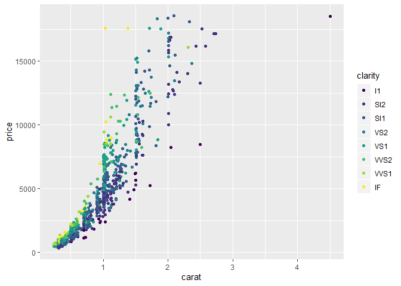
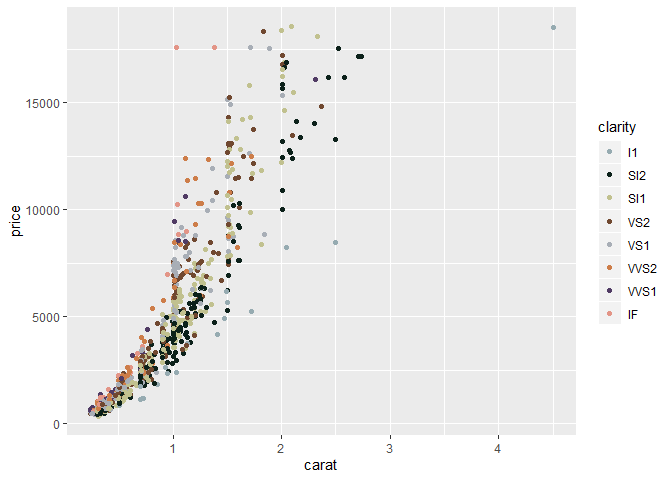
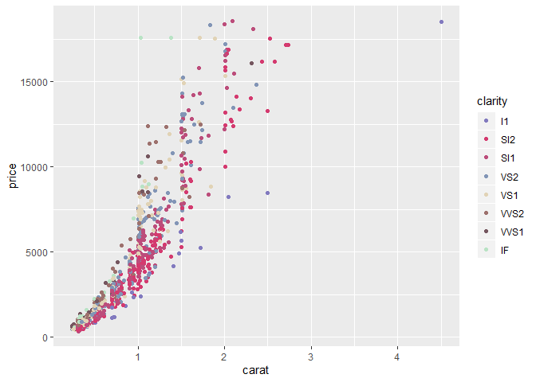
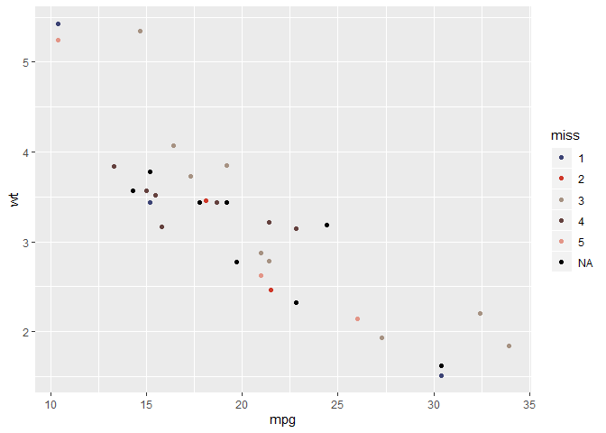

Disney Palettes
---------------


Palette Colours from a blog post
[here](http://elijahmeeks.com/#content/blog/2015_08_17_palettes).
Palette made following blog post
[here](https://drsimonj.svbtle.com/creating-corporate-colour-palettes-for-ggplot2)

Installation
------------

**The development version**

``` r
devtools::install_github("sciencificity/disneycolouR")
```

Usage
-----

``` r
library(disneycolouR)
# See all palettes
names(disney_palettes)
#> [1] "main"                "cinderella"          "monet"              
#> [4] "small_world"         "alice"               "pan"                
#> [7] "when_i_was_your_age"

# See number discrete values in "main" the combo palette
str_glue("The number of discrete colours in the `main` palette is: {length(disney_palettes[['main']])}")
#> The number of discrete colours in the `main` palette is: 35

# Examples taken from ?scale_colour_discrete and amended
dsamp <- diamonds[sample(nrow(diamonds), 1000), ]
(d <- ggplot(dsamp, aes(carat, price)) + geom_point(aes(colour = clarity)))
```



``` r
# Change scale to disney default
d + scale_colour_disney()
```



``` r
# Change scale to disney - `alice` palette
d + scale_colour_disney("alice")
```



``` r

# Lookup colours of one palette
disney_palettes[["cinderella"]]
#>     cind1     cind2     cind3     cind4     cind5 
#> "#96abb1" "#313746" "#b0909d" "#687a97" "#292014"

# Another example taken from ?scale_colour_discrete and amended
miss <- factor(sample(c(NA, 1:5), nrow(mtcars), replace = TRUE))
ggplot(mtcars, aes(mpg, wt)) +
  geom_point(aes(colour = miss)) +
  scale_colour_disney()
```


